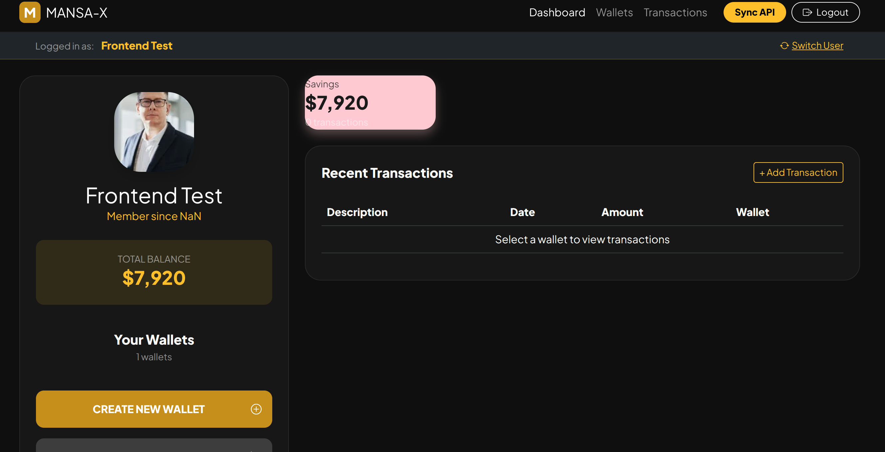
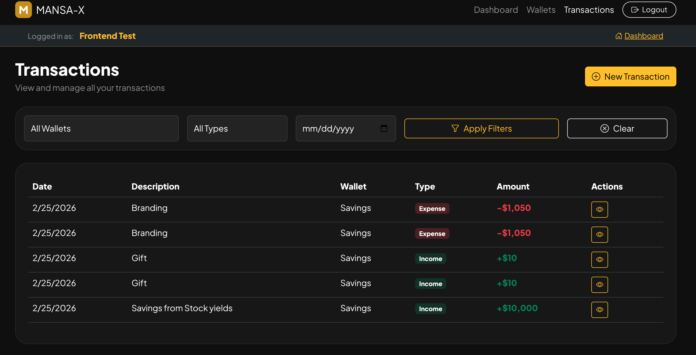

# 💰 Money Tracker - Frontend

A simple, elegant personal finance dashboard that helps you track your income, expenses, and wallets. This frontend application connects to a Laravel backend API to provide real-time financial tracking.

## 📸 Screenshots

### Dashboard View

*Main dashboard showing user profile, total balance, wallet cards, and recent transactions*

### Wallet Details & Transactions

*Detailed wallet view with transaction history and quick stats*

## 📁 Project Structure

```
simple_money_front/
│
├── index.html          # Main dashboard - User profile, wallets overview, recent transactions
├── wallets.html        # Dedicated wallets management page with detailed wallet cards
├── transactions.html   # Complete transaction history with filtering capabilities
├── style.css           # All styling, animations, and responsive design
├── app.js              # Core JavaScript - API calls, state management, UI updates
└── README.md           # Project documentation
```

## ✨ Features

### Implemented Functionality
- **User Management** - Create new users or select from existing ones (no authentication required)
- **Wallet Management** - Create multiple wallets per user with custom names and initial balances
- **Transaction Tracking** - Add income and expense transactions to any wallet
- **Dashboard Overview** - View all wallets, individual balances, and total balance across all wallets
- **Wallet Details** - Click any wallet to see detailed view with balance and all transactions
- **Transaction History** - Complete transaction log with filters by wallet, type, and date
- **Real-time Updates** - Balances update instantly when transactions are added

### Technical Highlights
- **Single Page App Feel** - Smooth navigation between dashboard, wallets, and transactions
- **Responsive Design** - Works perfectly on desktop, tablet, and mobile devices
- **Glass Morphism UI** - Modern, visually appealing interface with blur effects
- **Session Persistence** - Remembers logged-in user across page reloads

## 🚀 Live Demo

- **Frontend**: [https://simple-money-front.vercel.app](https://simple-money-front.vercel.app)
- **Backend API**: [https://money-tracker-api-uesx.onrender.com](https://money-tracker-api-uesx.onrender.com)

## 🛠️ Technologies Used

- **HTML5** - Semantic structure
- **CSS3** - Custom properties, flexbox, grid, animations
- **Bootstrap 5** - Responsive components and grid system
- **Bootstrap Icons** - Clean, consistent icon set
- **JavaScript (ES6+)** - Async/await, fetch API, DOM manipulation
- **Google Fonts** - Plus Jakarta Sans font family

## 🔧 Setup & Installation

### Prerequisites
- A modern web browser (Chrome, Firefox, Safari, Edge)
- The backend API must be running (see backend repository)

### Local Development

1. **Clone the repository**
   ```bash
   git clone https://github.com/yourusername/simple_money_front.git
   cd simple_money_front
   ```

2. **Configure API endpoint**
   
   In `app.js`, update the `API_BASE` constant to point to your backend:
   ```javascript
   const API_BASE = "https://your-backend-url.onrender.com/api";
   ```
   For local development:
   ```javascript
   const API_BASE = "http://127.0.0.1:8000/api";
   ```

3. **Open the application**
   
   Simply open `index.html` in your browser, or use a local development server:
   ```bash
   # Using Python
   python -m http.server 8000
   
   # Using PHP
   php -S localhost:8000
   
   # Using VS Code Live Server extension
   # Right-click index.html → Open with Live Server
   ```

## 📱 How to Use

### 1. **Create or Select a User**
   - On first load, a modal appears to create a new user or select an existing one
   - Your session is saved, so you won't need to log in again

### 2. **Create Wallets**
   - Click "CREATE NEW WALLET" on the dashboard
   - Enter a wallet name and optional initial balance
   - Wallets appear as colored cards on the dashboard

### 3. **Add Transactions**
   - Click "Add Transaction" button
   - Select transaction type (Income/Expense)
   - Enter amount and description
   - Choose which wallet to apply the transaction to
   - The wallet balance updates immediately

### 4. **View Wallet Details**
   - Click any wallet card to see detailed view
   - View wallet balance, description, and all transactions
   - Quick stats show total income and expenses for that wallet

### 5. **Explore Transactions Page**
   - Navigate to "Transactions" in the navbar
   - View all transactions across all wallets
   - Filter by wallet, transaction type, or date
   - See summary cards with totals

## 🌐 API Integration

This frontend connects to a Laravel backend with the following endpoints:

| Endpoint | Method | Description |
|----------|--------|-------------|
| `/api/users` | GET | Get all users |
| `/api/users` | POST | Create a new user |
| `/api/users/{id}` | GET | Get specific user with wallets |
| `/api/wallets` | POST | Create a new wallet |
| `/api/wallets/{id}` | GET | Get wallet details |
| `/api/transactions` | GET | Get all transactions |
| `/api/transactions` | POST | Create a new transaction |

## 🎨 Design Features

- **Dark Theme** - Easy on the eyes with gold accent colors
- **Glass Morphism** - Frosted glass effect on cards and panels
- **Responsive Grid** - Wallets reorganize gracefully on smaller screens
- **Loading States** - Visual feedback during API calls
- **Success/Error Toasts** - Non-intrusive notifications
- **Smooth Animations** - Subtle hover effects and transitions

## 🤝 Contributing

Contributions are welcome! Feel free to:
- Report bugs
- Suggest new features
- Submit pull requests

## 📄 License

This project is open source and available under the [MIT License](LICENSE).

## 🙏 Acknowledgments

- Bootstrap team for the amazing framework
- Google Fonts for Plus Jakarta Sans
- Icons from Bootstrap Icons

---

**Built with ❤️ using vanilla JavaScript and Bootstrap**